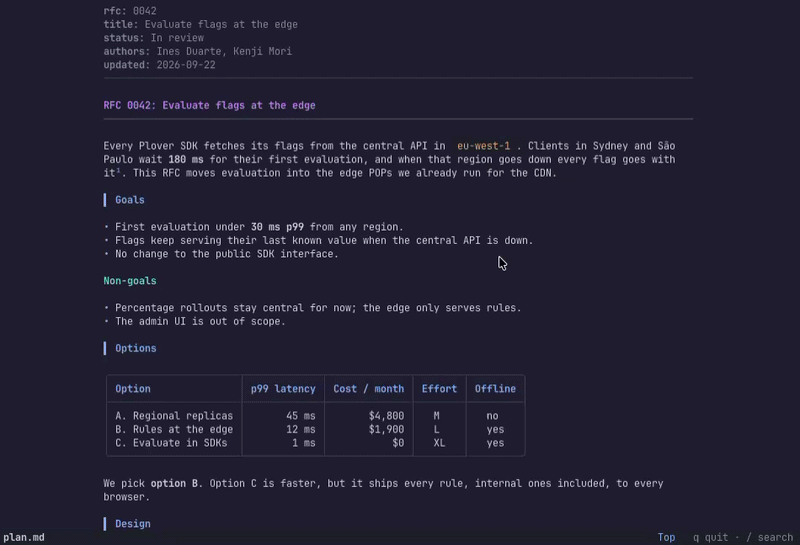
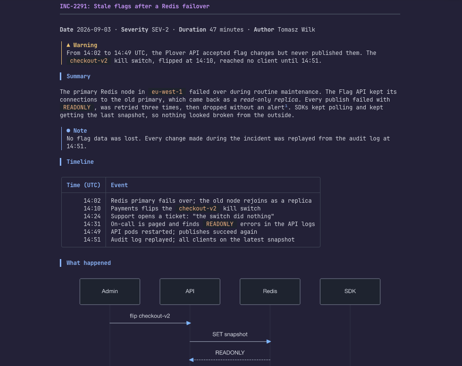
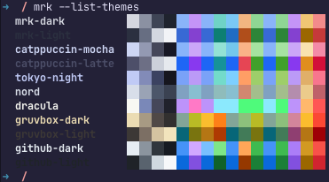
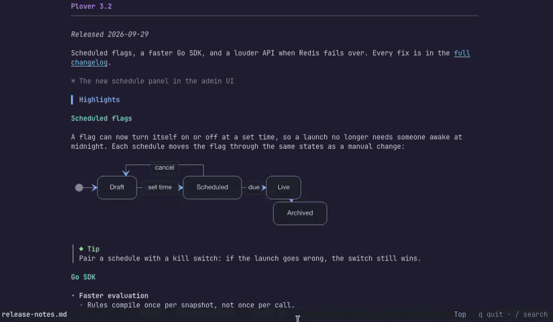

# mrk

Read Markdown in your terminal as a well-set page, with Mermaid diagrams drawn as real images.



`mrk` turns headings, tables, code, alerts, task lists and footnotes into calm colour and clean spacing, with no `#` or `*` left on screen.
On terminals that can show pictures, Mermaid diagrams appear as images; everywhere else they become box-drawing text.

## Install

```sh
brew install vmeyet/tap/mrk
```

Or with the shell installer, or from source (Rust 1.92 or newer):

```sh
curl --proto '=https' --tlsv1.2 -LsSf https://github.com/vmeyet/mrk-cli/releases/latest/download/mrk-cli-installer.sh | sh
cargo install --locked --git https://github.com/vmeyet/mrk-cli
```

Prebuilt binaries cover macOS and Linux, on x86_64 and arm64.
On Alpine or an old glibc, the shell installer picks a static musl build.

## Quick start

```sh
mrk README.md                     # render a file
cat notes.md | mrk                # or stdin
mrk -p design.md                  # read it in the pager, diagrams included
mrk --theme tokyo-night notes.md  # pick a theme
```

The [`examples/`](examples/) folder holds three real-looking documents to try it on: an RFC, a post-mortem and release notes.

## Features

- **GitHub Markdown**: headings, nested lists, task lists, aligned tables, quotes, alerts (`> [!NOTE]`), footnotes, front matter, images as their alt text.
- **Clickable links** through OSC 8 hyperlinks; where links cannot be clicked, the URL is printed after the text.
- **Code like in your editor**: syntax highlighting with bat's language set, in a panel labelled with the language.
- **Mermaid diagrams as pictures**: flowcharts, sequence, state, class and ER diagrams, gantt and pie charts, and more, scaled so labels match your font size.
  Labels render even on a system with no fonts installed.
- **11 themes**, light or dark picked from your terminal background.
- **A pager that keeps pictures**, with search: `less` drops images, `mrk -p` does not.
- **Fits the window**: wraps at the terminal width (100 columns at most) and centres the text in a wide window.
- **Big titles**, opt-in with `--jumbo-title`: level-1 headings two rows tall, as a picture on terminals that show images, as double-height text on xterm, Konsole, Windows Terminal, mlterm and iTerm2.



## Terminal support

| Terminal                                          | Mermaid diagrams                   |
| :------------------------------------------------ | :--------------------------------- |
| Ghostty, kitty, WezTerm                           | images, kitty graphics protocol    |
| foot, Konsole, xterm and others that offer Sixel  | images, Sixel                      |
| tmux 3.3 or newer, in Ghostty, kitty or WezTerm   | images, once passthrough is on     |
| iTerm2, Apple Terminal, VS Code, screen, zellij   | box-drawing text                   |

For tmux, add this line to `~/.tmux.conf`:

```tmux
set -g allow-passthrough on
```

A tmux 3.4 built with Sixel draws Sixel pictures itself and needs no passthrough.
Piped output never gets pictures; `--images never` turns them off everywhere.

## Configure

Settings come from flags first, then environment variables, then the config file.
Put the config in `~/.config/mrk/config.toml` (or `$XDG_CONFIG_HOME/mrk/config.toml`):

```toml
theme = "tokyo-night"
width = 90
align = "left"
pager = true
jumbo_title = true
```

`mrk --list-themes`
 shows every theme with a swatch of its colours:
`mrk-dark`, `mrk-light`, `catppuccin-mocha`, `catppuccin-latte`, `tokyo-night`, `nord`, `dracula`, `gruvbox-dark`, `gruvbox-light`, `github-dark`, `github-light`.
Without a theme, mrk picks `mrk-dark` or `mrk-light` from the terminal background.



Every flag, variable, config key and exit code is in the [reference](docs/reference.md).

## Pager

`mrk -p FILE`, or `pager = true` in the config, opens the built-in pager.
It keeps diagrams as images and stays open until you press `q`.



| Keys                                    | Action                        |
| :-------------------------------------- | :---------------------------- |
| `j` `k`, `↓` `↑`                        | down / up a row               |
| `Space` `b`, `Page Down` `Page Up`      | down / up a page              |
| `d` `u`                                 | down / up half a page         |
| `g` `G`, `Home` `End`                   | top / bottom                  |
| `/`, then `n` `N`                       | search, next / previous match |
| `q`, `Esc`                              | quit                          |

`mrk --help` lists every key.
To use another pager, set `MRK_PAGER="less -R"`; diagrams then become text.

## Update

```sh
mrk update          # install the latest release when it is newer
mrk update --force  # reinstall it anyway
```

When Homebrew installed mrk, this runs `brew upgrade vmeyet/tap/mrk`.
Otherwise it rebuilds the release with cargo, so it needs git and a Rust toolchain.
It is the only command that uses the network.

## Security

A Markdown file from a cloned repo is untrusted, and a terminal runs the escape sequences it receives.
mrk removes control characters and escape sequences from everything it prints, keeps only `http`, `https`, `mailto` and `file` links clickable, and never fetches an image or a URL.
The full rules are in [`specs/02-security.md`](specs/02-security.md).

## More

- [Reference](docs/reference.md): options, environment, config file, exit codes, shell completions and the man page.
- [Library](docs/library.md): render Markdown from Rust, without the terminal parts.
- [Specs](specs/) and [`AGENTS.md`](AGENTS.md): the design and the rules for contributing; `scripts/check` runs every check CI runs.

## License

MIT.
Mermaid labels fall back on an embedded Latin subset of [DejaVu Sans](https://dejavu-fonts.github.io/), renamed `mrk Sans`, under its own license in `assets/fonts/LICENSE-DejaVu`.
