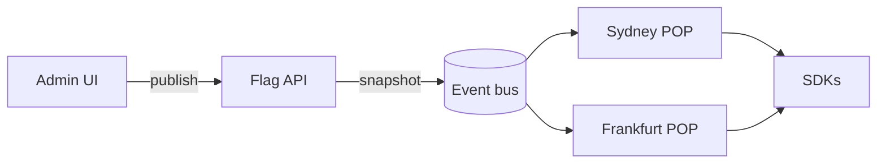

# RFC 0042: Evaluate flags at the edge

Every Plover SDK fetches its flags from the central API in `eu-west-1`.
Clients in Sydney and São Paulo wait **180 ms** for their first evaluation, and when that region goes down every flag goes with it[^inc].
This RFC moves evaluation into the edge POPs we already run for the CDN.

## Goals

- First evaluation under **30 ms p99** from any region.
- Flags keep serving their last known value when the central API is down.
- No change to the public SDK interface.

### Non-goals

- Percentage rollouts stay central for now; the edge only serves rules.
- The admin UI is out of scope.

## Options

| Option               | p99 latency | Cost / month | Effort | Offline |
| :------------------- | ----------: | -----------: | :----: | :-----: |
| A. Regional replicas |       45 ms |       $4,800 |   M    |   no    |
| B. Rules at the edge |       12 ms |       $1,900 |   L    |   yes   |
| C. Evaluate in SDKs  |        1 ms |           $0 |   XL   |   yes   |

We pick **option B**.
Option C is faster, but it ships every rule, internal ones included, to every browser.

## Design



The API publishes a snapshot of every environment on each change.
A POP keeps the latest snapshot in memory and on disk, so a restart never waits for the bus.

The edge worker evaluates a flag in a single pass over its rules:

```rust
pub fn evaluate(flag: &Flag, user: &User) -> Variant {
    flag.rules
        .iter()
        .find(|rule| rule.matches(user))
        .map_or(flag.default, |rule| rule.variant)
}
```

Callers keep the code they have today; only the endpoint behind `connect` changes:

```typescript
const plover = await Plover.connect({ key: process.env.PLOVER_KEY });

if (plover.enabled("checkout-v2", { userId: session.userId })) {
  renderNewCheckout();
}
```

## Rollout

1. Ship the snapshot publisher behind the `edge_snapshots` flag.
2. Shadow real traffic in two POPs and compare every answer with the central API.
3. Switch the default SDK endpoint, one region at a time.

- [x] Snapshot format agreed with the SDK team
- [x] Publisher prototype
- [ ] Shadow traffic in Sydney and Frankfurt
- [ ] Load test at 50k evaluations per second
- [ ] Update the [SDK guide](https://docs.plover.dev/sdk/endpoints)

## Open question

> Do we need signed snapshots, or is mTLS between the bus and the POPs enough?
> Signing costs us a key rotation story; mTLS does not cover a compromised POP.

[^inc]: See the [post-mortem of INC-2291](postmortem.md), 47 minutes of stale flags after a Redis failover.
