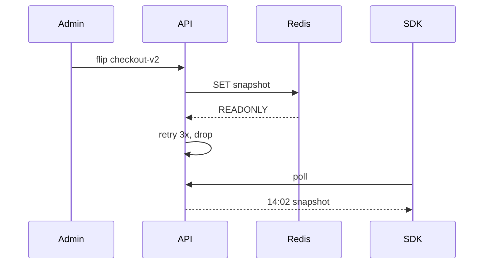

# INC-2291: Stale flags after a Redis failover

**Date** 2026-09-03 · **Severity** SEV-2 · **Duration** 47 minutes · **Author** Tomasz Wilk

> [!WARNING]
> From 14:02 to 14:49 UTC, the Plover API accepted flag changes but never published them.
> The `checkout-v2` kill switch, flipped at 14:10, reached no client until 14:51.

## Summary

The primary Redis node in `eu-west-1` failed over during routine maintenance.
The Flag API kept its connections to the old primary, which came back as a *read-only replica*.
Every publish failed with `READONLY`, was retried three times, then dropped without an alert[^retry].
SDKs kept polling and kept getting the last snapshot, so nothing looked broken from the outside.

> [!NOTE]
> No flag data was lost.
> Every change made during the incident was replayed from the audit log at 14:51.

## Timeline

| Time (UTC) | Event                                                          |
| ---------: | :------------------------------------------------------------- |
|      14:02 | Redis primary fails over; the old node rejoins as a replica   |
|      14:10 | Payments flips the `checkout-v2` kill switch                  |
|      14:24 | Support opens a ticket: "the switch did nothing"              |
|      14:31 | On-call is paged and finds `READONLY` errors in the API logs  |
|      14:49 | API pods restarted; publishes succeed again                   |
|      14:51 | Audit log replayed; all clients on the latest snapshot        |

## What happened



The API logged each failure, but at `WARN`, which pages no one:

```
14:10:31.207 WARN  publish flag=checkout-v2 attempt=1 err=READONLY
14:10:31.412 WARN  publish flag=checkout-v2 attempt=2 err=READONLY
14:10:31.820 WARN  publish flag=checkout-v2 attempt=3 err=READONLY
```

On-call confirmed the role change and restarted the API:

```sh
redis-cli -h flags-redis.eu-west-1.internal role
kubectl -n plover rollout restart deployment/flag-api
kubectl -n plover rollout status deployment/flag-api --timeout=120s
```

## Impact

> We hit the kill switch and the broken checkout stayed up for another forty minutes.
> We had no way to tell whether Plover or our own deploy was at fault.

That ticket, from a payments customer, sums it up.
About 31% of evaluations during the window returned a value older than the latest change[^sla].

## What went well

- Support escalated within 14 minutes of the first ticket.
- The audit log made the replay a single command.

## What went wrong

- The API never checks the Redis role after a reconnect.
- A dropped publish is a warning, not an error.
- Our status page showed every system green throughout.

## Action items

- [x] Page on any dropped publish (Tomasz)
- [x] Reconnect when Redis answers `READONLY` (Kenji)
- [ ] Add a publish-to-SDK freshness probe per region (Amara)
- [ ] Serve flags from the edge, so one region cannot stall every client: [RFC 0042](plan.md) (Ines)

[^retry]: The retry policy dates from 2023, when publishes went to Postgres and a failure there always raised an error.
[^sla]: Below our 99.9% freshness target for September; affected customers get the credit automatically.
