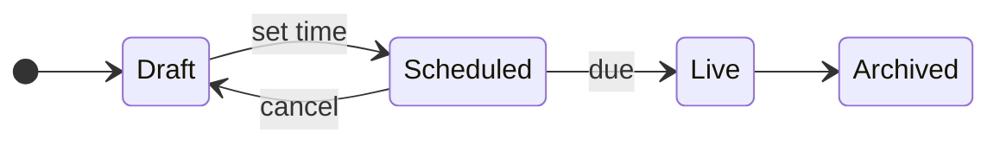

# Plover 3.2

*Released 2026-09-29*

Scheduled flags, a faster Go SDK, and a louder API when Redis fails over.
Every fix is in the [full changelog](https://github.com/plover-flags/plover/releases/tag/v3.2.0).


## Highlights

### Scheduled flags

A flag can now turn itself on or off at a set time, so a launch no longer needs someone awake at midnight.
Each schedule moves the flag through the same states as a manual change:



> [!TIP]
> Pair a schedule with a kill switch: if the launch goes wrong, the switch still wins.

### Go SDK

- **Faster evaluation**
  - Rules compile once per snapshot, not once per call.
  - `Enabled` is about 4x faster on flags with more than ten rules.
- **Smaller footprint**
  - The protobuf dependency is gone; snapshots are plain JSON.
  - Binaries that embed the SDK are 2.1 MB smaller.

---

## Upgrading

Upgrade with `helm upgrade plover plover/plover --version 3.2.0`.

> [!IMPORTANT]
> 3.2 needs Redis 7.0 or newer.
> The API refuses to start on an older server and says so in its first log line.

### From 3.1

#### Configuration changes

The `publish_retries` setting is gone: a dropped publish now fails loudly instead of retrying in silence.
Add a freshness probe in its place:

```diff
 [redis]
 url = "redis://flags-redis:6379"
-publish_retries = 3
+
+[probe]
+freshness_interval = "30s"
+alert_after = "2m"
```

#### Deprecations

1. ~~`Plover.init()`~~ in the JavaScript SDK; use `Plover.connect()`.
2. The `/v1/flags` endpoint; it stops answering in 4.0.

> [!CAUTION]
> Do not downgrade to 3.1 once a schedule exists: 3.1 drops scheduled flags back to *Draft* without warning.

---

## Thanks

To the 14 people who sent pull requests this cycle, and to the payments team for the incident report that started the probe work.
Questions go to <https://community.plover.dev>.
