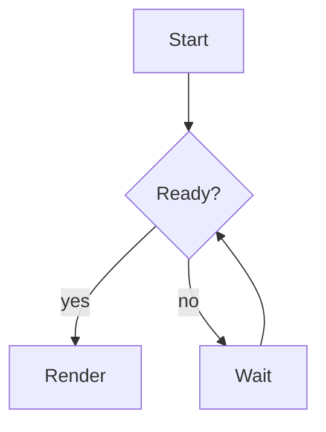
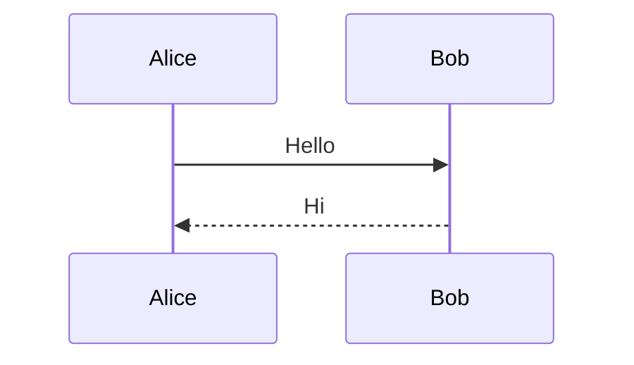

# mrk showcase

A paragraph with **bold**, *italic*, ~~struck~~, `inline code`, a [link](https://example.com), an autolink https://example.org and a footnote[^1]. It is long enough to wrap across more than one line at eighty columns, so wrapping shows.

## Lists

- First item
- Second item with a longer text that needs to wrap onto a second line to show the hanging indent working
  - Nested item
    - Deeper item
1. One
2. Two
10. Ten

- [x] Done task
- [ ] Open task

### Quotes and alerts

> A quote, with *emphasis*, that is long enough to wrap onto a second line so the bar repeats.

> [!NOTE]
> Useful information.

> [!WARNING]
> Careful here.

#### Code

```rust
fn main() {
    let greeting = "hello"; // a comment
    println!("{greeting}, world");
}
```

```
no language here
```

##### Table

| Name | Left | Center | Right |
|------|:-----|:------:|------:|
| mrk  | a    | b      | 1     |
| glow | longer cell text | c | 22 |

###### Rule and image

---






[^1]: The footnote text.
